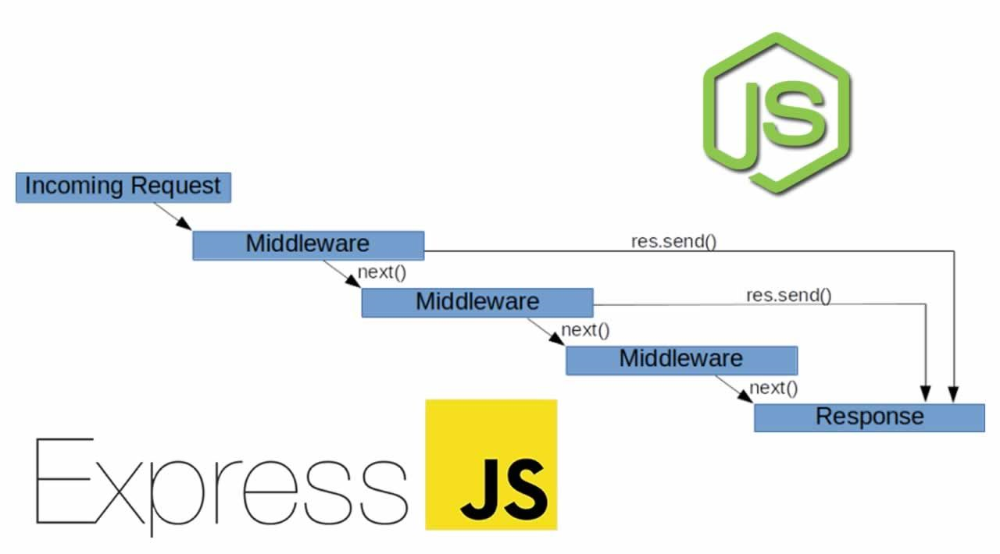

# express-generator

###### https://www.npmjs.com/package/express-generator

<br/>

## Installation

```bash
$ npm install -g express-generator
```

<br/>

## Quick Start

```bash
$ express learn-express --view=pug

$ cd learn-express && npm i

$ npm start

# check http://localhost:3000/
# check http://localhost:3000/users
```

<br/>

